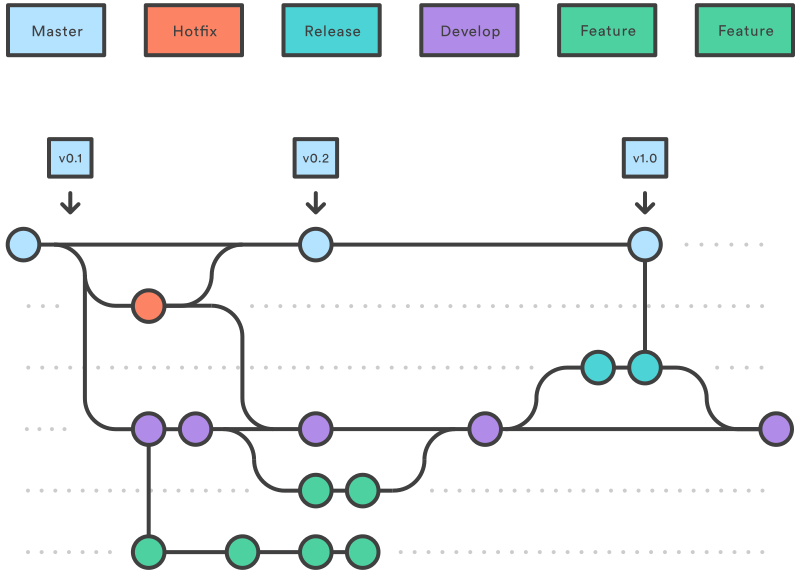

O versionamento de código é um importante pilar do projeto **XXXXX** pois todo o código-fonte tanto do front-end como do back-end é armazenado em repositórios no GitHub pertencentes à organização ``React Native Group``. O Git fornece inúmeras vantagens do ponto de vista de desenvolvimento pois permite que várias versões sejam criadas do código fonte e cada alteração seja devidamente catalogada em uma espécie de histórico. Essas diferentes versões do código são os commits, que pouco a pouco os desenvolvedores criam para introduzir novos trechos de código, arquivos e funcionalidades com a finalidade de incrementar o software. O **XXXXX** possui dois repositórios, o **Seja-UPE** e o **Seja-UPE-API**, que hospedam o código da aplicação móvel e da API REST, respectivamente. Em cada repositório desse há uma branch ``main`` que é a branch principal, onde o código de produção está hospedado. Para que os desenvolvedores possam introduzir novas funcionalidades no sistema, é necessário adotar um modelo de versionamento de branchs para versionar o código e permitir que outros desenvolvedores colaborem com suas funcionalidades mas em branchs separadas para evitar conflitos, como ocorreria se todos os desenvolvedores utilizassem a branch main. Esse modelo de versionamento de branchs é o GitFlow, que será visto a seguir.

<p align="center">
  
</p>

O GitFlow, como mencionado, é um modelo de versionamento de branchs para repositórios Git que divide a responsabilidade de desenvolvimento em diferentes branchs. O fluxo geral do Gitflow é:

1. Uma ramificação ``develop`` é criada a partir de ``main``;
2. Uma ramificação ``release`` é criada a partir de ``develop``;
3. As ramificações ``feature`` são criadas a partir de ``develop``;
4. Quando a ``feature`` é concluída, ela é mesclada na ramificação ``develop``;
5. Quando o ``release`` é concluído, ela é mesclado nas ramificações ``develop`` e ``main``;
6. Se um problema for detectado na ramificação ``main``, uma ramificação ``hotfix`` será criada a partir de ``main``;
7. Uma vez que o ``hotfix`` é concluído, ele é mesclado para ambos ``develop`` e ``main``.

As branchs que compõem o GitFlow são:

1. **main** - Nessa branch é contido todo o código de produção. Sempre que a branch development possui estabilidade para ser liberada em produção, ela é então mesclada com essa branch;
2. **develop/development** - Nessa branch é contido o código de desenvolvimento. Esse código é constantemente alterado e recebe novos merges de branchs secundárias como **feature/\*** e **bugfix/\***. Essa branch não recebe código e commits diretamente, mas é alterada e recebe mesclagens das branchs citadas. Quando o código atinge maturidade para ir à produção, ela então é mesclada com a **main** após ser gerado um release na branch **release**;
3. **feature** - Cada nova funcionalidade criada deve ter uma branch associada com o prefixo **feature/\***. O desenvolvedor deve trabalhar nessa branch e quando concluir sua funcionalidade mesclar com a branch **develop/development** através de um Pull Request;
4. **bugfix** - Correções de bugs e problemas no sistema devem ser feitas a partir de branchs com esse prefixo (**bugfix/\***). Quando uma correção é concluída e precisa ser mesclada com o código em desenvolvimento, o desenvolvedor deve então mesclar essa branch com a **develop/development** também através de um Pull Request;
5. **hotfix** - Correções críticas que devem entrar diretamente em ambiente de produção (**main**) devem ser feitos a partir de branchs com o prefixo **hotfix/\***. O desenvolvedor deve trabalhar na correção e, uma vez concluída, abrir um Pull Request para mesclar suas alterações com a branch **main** e também com a branch **develop/development**;
6. **release** - Nessa branch, a cada lançamento de código estável da **develop/development** deve ser enviado para a branch release para manter o histórico de lançamentos realizados e suas versões.

O próprio git facilita a utilização do GitFlow pois seu utilitário de linha de comando fornece a possibilidade de se trabalhar com cada uma dessas branchs mencionadas sem ter de criá-las na mão. 

>[!TIP]
>O commando ``git flow feature start <nome-da-funcionalidade>`` é um exemplo de instrução que pode ser utilizada para criar uma nova funcionalidade seguindo o padrão do GitFlow. Após a criação da funcionalidade, uma nova branch será gerada com o nome ``feature/<nome-da-funcionalidade>``. Para finalizar a branch e mesclá-la com a development, o comando é muito parecido, mudando apenas o termo start por finish: ``git flow feature finish <nome-da-funcionalidade>``. Para mais informações, consulte este [**cheatsheet**](https://danielkummer.github.io/git-flow-cheatsheet/).

Agora que você conhece o modelo de fluxo de trabalho utilizado no versionamento Git, há mais alguns padrões importantes que o **XXXXX** adota com relação aos commits nos repositórios. São dois padrões utilizados para criar um commit, o primeiro é um lintter chamado ``Gitmoji`` que utiliza Emojis para classificar commits e marcá-los quanto a seu propósito. Cada Emoji possui um um significado e torna mais fácil entender o que o commit faz quando esse emoji é prefixado no título do commit. O Gitmoji proporciona dezenas de Emojis para serem utilizados.

>[!TIP]
>O Gitmoji pode ser instalado seguindo as instruções em [**Gitmoji Docs**](https://gitmoji.dev/). Para começar a utilizá-lo, ao invés de executar o comando ``git commit -m "minha-mensagem"`` você deverá utilizar o comando ``gitmoji -c``.

Por último, mas não menos importante, há o segundo padrão de commit chamado ``Conventional Commits`` que é responsável por prefixar um termo no título do commit. Esse padrão de commit propõe que seja utilizada uma palavra para descrever a ação realizada no commit e facilitar para quem está a procura de certos commits e alterações realizadas, sem necessitar abrir o commit para ver quais alterações foram feitas. O ``Conventional Commits`` toma emprestado alguns termos da ``Convenção Angular``, que é um padrão amplamente utilizado na Google pelos desenvolvedores do Angular. Alguns dos termos são:

- ``fix`` (Correções de bugs);
- ``feature`` (Adição de nova funcionalidade);
- ``BREAKING CHANGE`` (Mudanças radicais/quebra de compatibilidade ou Major Release);
- ``build`` (Alterações referentes à configurações de build);
- ``chore`` (Alterações em arquivos de forma genérica, mudanças em pastas, renomeação de arquivos e pastas, mover diretórios);
- ``ci`` (Continuous Integration - Configurações referentes à Integração Contínua);
- ``docs`` (Alterações referentes à documentação do software);
- ``style`` (Alterações em estilos CSS, SCSS ou estilização de interface gráfica em geral);
- ``refactor`` (Alterações com propósito de refatorar o código-fonte do software);
- ``perf`` (Alterações que impactam na performance/desempenho do software);
- ``test`` (Alterações que adicionam ou modificam testes ou casos de teste).

>[!TIP]
>Um commit realizado no **XXXXX** com a aderência dos padrões de commit apresentados resulta em algo parecido com ```📝 docs: Updated README informations.```