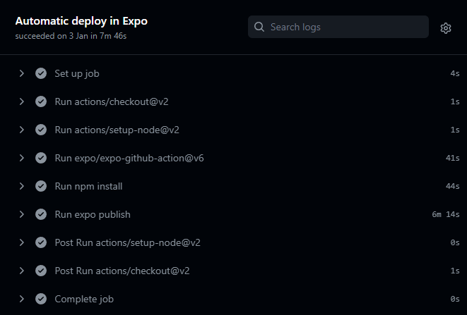
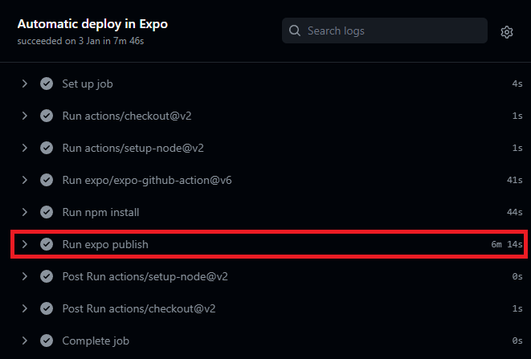
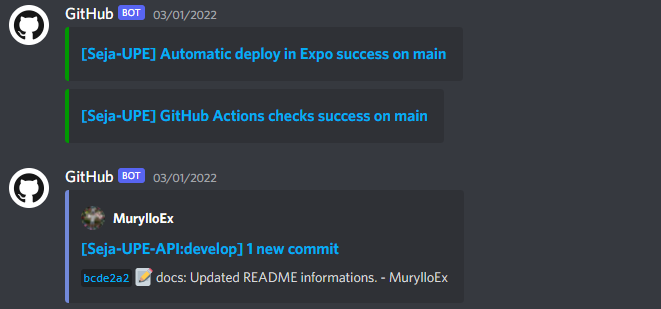

O DevOps é a combinação de filosofias culturais, práticas e ferramentas que aumentam a capacidade de uma empresa de distribuir aplicativos e serviços em alta velocidade: otimizando e aperfeiçoando produtos em um ritmo mais rápido do que o das empresas que usam processos tradicionais de desenvolvimento de software e gerenciamento de infraestrutura. Essa velocidade permite que as empresas atendam melhor aos seus clientes e consigam competir de modo mais eficaz no mercado.

<p align="center">
  
</p>

#### Benefícios do DevOps

- **Velocidade**

  Opere em alta velocidade para que você possa trazer inovações para os seus clientes mais rapidamente, adaptar-se melhor a mercados dinâmicos e tornar-se mais eficiente na geração de resultados comerciais. O modelo de DevOps permite que as suas equipes de desenvolvedores e operações atinjam esses resultados. Por exemplo, os microsserviços e a entrega contínua permitem que as equipes assumam a responsabilidade sobre os serviços e, então, lancem atualizações para eles mais rapidamente.

- **Entrega rápida**

  Aumente a frequência e o ritmo de lançamentos para poder inovar e melhorar seu produto mais rapidamente. Quanto mais rápido você puder lançar novos recursos e corrigir erros, maior será a sua agilidade para responder às necessidades dos clientes e criar vantagem competitiva. A integração e a entrega contínuas são práticas que automatizam o processo de lançamento de software, da fase de criação à fase de implantação.

- **Confiabilidade**

  Garanta a qualidade das atualizações de aplicativos e alterações de infraestrutura para que você possa entregar com confiança em um ritmo mais rápido, sem deixar de manter uma experiência positiva para os usuários finais. Use práticas como a integração e a entrega contínuas para testar se cada umas das alterações funciona e é segura. As práticas de monitoramento e registro em log ajudam você a permanecer informado sobre a performance em tempo real.

- **Escala**

  Opere e gerencie seus processos de infraestrutura e desenvolvimento em escala. A automação e a constância ajudam você a gerenciar sistemas complexos ou dinâmicos com eficiência e risco reduzido. Por exemplo, a infraestrutura como código ajuda você a gerenciar seus ambientes de implantação, teste e produção de modo repetido e mais eficiente.

- **Colaboração melhorada**

  Crie equipes mais eficientes em um modelo cultural de DevOps, que enfatiza valores como propriedade e responsabilidade. As equipes de desenvolvedores e operações colaboram de perto, compartilham muitas responsabilidades e combinam seus fluxos de trabalho. Isso reduz ineficiências e economiza tempo (por exemplo, períodos de transferência reduzidos entre desenvolvedores e operações, desenvolvimento de código que considera o ambiente em que é executado).

- **Segurança**

  Opere rapidamente enquanto mantém o controle e preserva a conformidade. Você pode adotar o modelo de DevOps sem sacrificar a segurança usando políticas de conformidade automáticas, controles minuciosos e técnicas de gerenciamento de configuração. Por exemplo, usando a infraestrutura e a política como código, você pode definir e acompanhar a conformidade em escala.

#### 2.2.1 GitHub Actions Pipelines

Quando um Pull Request é aceito para branch ``main``, as GitHub actions são acionadas no projeto. Para se configurar uma pipeline, ou seja, uma GitHub Action é necessário especificar a branch alvo, a ação que desencadeia a execução da pipeline e os jobs que devem ser realizados. 

<p align="center">
  
</p>

A seguir você verá um exemplo de pipeline no GitHub Actions:

```yml
name: Expo Automatic Deploy
on:
  push:
    branches: [main]
jobs:
  publish:
    name: Automatic deploy in Expo
    runs-on: ubuntu-latest
    steps:
      - uses: actions/checkout@v2
      - uses: actions/setup-node@v2
        with: 
          node-version: 14.x
      - uses: expo/expo-github-action@v6
        with:
          expo-version: 4.x
          token: ${{ secrets.EXPO_TOKEN }}
      - run: npm install
      - run: expo publish
```

>[!ATTENTION]
>A pipeline acima quando entra em execução demora em média 7 minutos para finalizar. Suas ações envolvem: (1) configurar o ambiente do Node.js; (2) baixar as dependências do projeto; (3) compilar e publicar a aplicação na esteira de desenvolvimento do Expo.

>[!NOTE]
>É importante notar que o processo de compilação do projeto é feito pelo Expo, pois o projeto utiliza o Workflow Managed onde as dependências nativas são geridas pelo Expo. Do ponto de vista arquitetural, isso tira a responsabilidade do programador ter instalado em sua máquina o Android Studio e outras ferramentas de compilação, pois o Expo já realiza esse procedimento.

#### 2.2.3 Build automático

O processo de build dos assets gerenciados, imagens e execução de scripts do lado do TypeScript/JavaScript são realizados na execução do comando ``npm install``. Já a construção do binário APK/AAB utilizado para instalação no aparelho são gerados inteiramente pelo Expo pois as dependências do Android e arquivos Java, Kotlin, Swift, Objective-C são todos retidos pelo Expo. Essa é uma de suas maiores vantagens, por isso parte do processo de build ocorre durante a fase de implantação no Expo. 

<p align="center">
  
</p>

#### 2.2.4 Deployment automático

Essa é a fase onde ocorre de fato a construção do APK/AAB da aplicação. O que ocorre é que, logo após ter sido executado o ``npm install`` do projeto, as dependências Node.js são enviadas para o Expo através de um processo de upload de arquivos automático pela pipeline, onde o Expo constrói os binários multiplataforma, empacota e disponibiliza o acesso tanto na esteira como em seu painel de build. É possível extrair o AAB da build e realizar seu upload na PlayStore sem a necessidade do Android Studio. O equivalente também é possível utilizando o comando ``npm run build``, mas é necessário ter executado o ``npm install`` previamente na máquina de desenvolvimento.

<p align="center">
  
</p>

#### 2.2.5 GitHub Webhooks Notifications no Discord

Como parte do processo de DevOps, há a coleta de informações após o software estar em execução e no momento do desenvolvimento, para identificar etapas bem-sucedidas e principalmente mal-sucedidas. O Discord atua como um importante aliado nesse aspecto pois permite que seja registrado um Webhook do Discord no GitHub e a cada ação realizada, não apenas em um repositório, mas em toda a organização do GitHub (React Native Group), o Discord é notificado e exibe através do Bot do GitHub informações referentes aquele ocorrido. As mensagens seguem o formato ilustrado na imagem a seguir.

<p align="center">
  
</p>