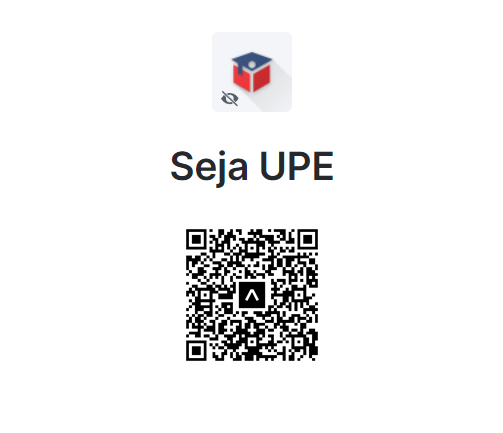

No **XXXXX** há dois tipos de publicação, a de produção e desenvolvimento. Na de desenvolvimento, fazemos a implantação da aplicação no Expo GO, enquanto a de produção fazemos a implantação na PlayStore. A seguir você verá como cada uma delas funciona.

#### 2.3.1 PlayStore

Um ponto importante para o sucesso do aplicativo e para que ele seja distribuido para o seu devido público é a publicação na PlayStore. O processo é puramente manual e envolve ter uma conta de desenvolvedor Google que custa U$ 25,00 dólares. Para que o aplicativo seja disponibilizado é necessário reservar um namespace único, que nesse caso é ``com.sejaupe.app`` e após reservá-lo, configurar a loja e responder a várias perguntas de segurança. 

>[!NOTE]
>O processo de validação da PlayStore é criterioso, podendo levar até 7 dias para ser concluído. Esse prazo deve ser levado em mente ao liberar novos aplicativos.

Há perguntas sobre o tipo de atividade exercida, se o aplicativo atrai crianças, se contém disseminação de imagens, se tem interação via bate-papo, se possui manifestação de opinião política ou religiosa, e até mesmo se propaga ideologias que possam ser consideradas inconstitucionais em certos países. Após responder a esse extenso espectro de perguntas, o aplicativo é submetido a uma rede de inteligência artificial que descompila e analisa parte do código-fonte em busca de trojans, vírus ou explorações que possam caracterizar a aplicação como nociva. Se tudo estiver são na aplicação, ela passa para uma etapa de verificação de anúncios, onde um robô acessa a aplicação e procura por monetizadores comuns. Aplicações monetizadas não podem ser direcionadas para crianças. Dado o conjunto de respostas fornecidas e a avaliação da rede de inteligência artificial feita pela Google no aplicativo, ele recebe uma classificação indicativa que determina qual a idade mínima para que o aplicativo possa ser utilizado. Devido ao **XXXXX** utilizar comunicação via bate-papo, a classificação indicativa recebida foi de ``12 Anos``.

Na PlayStore as atualizações podem ser feitas com praticidade, muito embora o processo de autorização e publicação possa demorar até 48 horas.

>[!ATTENTION]
>Cada atualização submetida à PlayStore é analisada por uma equipe, por isso o processo pode demorar até 48 horas. Além desse fator, o aplicativo recebe avaliações constantes quanto à detalhes de interface gráfica, responsividade e contrastes de cores que são disponibilizados como relatórios no Google Play Console.

A aplicação se encontra disponível na PlayStore publicamente e o padrão de versão que deve ser adotado é compatível com ``Conventional Commits``. Há uma correlação entre a versão da aplicação e a quantidade de commits do tipo ``fix``, ``feature`` e ``BREAKING CHANGE``, por exemplo.

>[!ATTENTION]
>Para se manter a consistência da versão exibida na PlayStore a relação entre ``Conventional Commits`` e a versão da aplicação na PlayStore deve ser respeitada. 
>*"Commits do tipo fix devem ser enviados para releases PATCH. Commits do tipo feat devem ser enviados para releases MINOR. Commits com BREAKING CHANGE nas mensagens, independentemente do tipo, devem ser enviados para releases MAJOR." - Conventional Commits*

#### 2.3.2 Expo Go

Um dos pontos fortes do ``Expo SDK`` é a possibilidade de a aplicação ser testada no Expo GO, um aplicativo para Android e iOS que permite que o desenvolvedor tenha uma visão de Hot Reload enquanto desenvolve o aplicativo sem a necessidade de recompilar o projeto quando alterações são feitas no código-fonte. Para que isso seja possível o desenvolvedor deverá executar o comando ``npm start`` no terminal, dentro do workspace do projeto e então através do Expo GO escanear o QR Code que aparece no próprio terminal ou na aba do navegador que se abrirá em instantes.

Esse tipo de interação com o aplicativo para testes internos também pode ser feito através de uma esteira de publicação no Expo, onde é gerado um QR Code para ser escaneado pelo Expo GO. Essa esteira de publicação é do tipo ``development`` e serve para visualizar pré-releases do aplicativo antes de enviá-los para a PlayStore. Sempre que um Pull Request é aprovado de ``develop`` para ``main`` a pipeline *Automatic deploy in Expo* é acionada e o aplicativo é construído/compilado e então publicado nessa esteira.

>[!TIP]
>Você pode acessar a esteira de desenvolvimento escaneando o QR Code apresentado abaixo ou acessando a esteira clicando [**aqui**](https://expo.dev/@muryllo/seja-upe-app).

  

