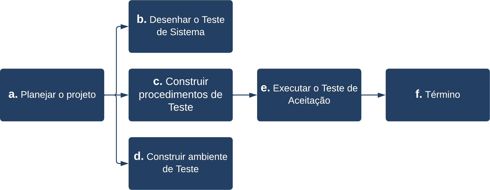

### 2.1 Requisitos que impactam na qualidade

Quando se trata no contexto da Engenharia de Software, qualidade de software pode ser entendido como um método gerencial que através de procedimentos disseminados pela organização, procuram garantir que o software satisfaça às expectativas e necessidades do cliente, dentro do que foi proposto inicialmente. Dessa forma, qualidade pode ser entendida como um conjunto de características que devem ser satisfeitas, de modo que o produto esteja em conformidade com as necessidades dos usuários. Para aferir esse nível de qualidade são necessários riscos envolvidos e os critérios, parâmetros de aferição. Esses parâmetros compõem uma classe de requisitos não funcionais, que são os que qualificam e restrigem como os requisitos funcionais do sistema devem ser implementados, assim como as decisões arquiteturais que são tomadas buscando atender às conformidades com as necessidades dos usuários. 
A seguir você pode visualizar alguns dos requisitos não funcionais do **XXXXX** que impactam na qualidade do sistema e seu impacto:

| Requisito | Impacto na Qualidade |
| --- | --- |
| RNF001 - Tempo de resposta | O requisito impacta na percepção das informações e carregamento de telas pelo usuário. |
| RNF002 - Período Ativo | O requisito impacta no tempo em que o aplicativo deve permanecer funcionando, bem como em serviço. |
| RNF004 - Proteção contra ataques DDoS | O requisito impacta na segurança do sistema e também na disponibilidade, podendo ser vital para manter o sistema funcionando corretamente. |
| RNF005 - Criptografia | O requisito impacta na segurança do sistema, sendo vital para preservar a privacidade dos usuários e sua segurança. |
| RNF007 - Documentação da API REST | O requisito impacta na capacidade de realizar manutenções, sendo vital para um bom entendimento do webservice. |

### 2.2 Características que impactam no tamanho do software

Há certas características e decisões arquiteturais que impactam no tamanho final do software. Essas características ou decisões tomadas visam facilitar o desenvolvimento, favorecendo um dos lados da tríade da Qualidade de Software no que diz respeito à **Custo**, **Tempo** e **Escopo**. A seguir, você pode visualizar algumas características da arquitetura do software que impactam no tamanho do software, mas que de forma direta ou indireta reduzem ou favorecem a equipe reduzindo o **Custo**, **Tempo** ou **Escopo** do sistema.

| Característica da Arquitetura | Impacto no tamanho |
| --- | --- |
| Framework de desenvolvimento para dispositivos móveis (React native) | O framework utilizado e seu SDK auxiliar (Expo) influenciam no tamanho do aplicativo final, que possui no mínimo 50MB de comprimento. |
| Framework de desenvolvimento para o back-end (NestJS) | O framework utilizado influenciam no tamanho do back-end e seu artefato final pois introduzem dependências a pacotes de terceiros que proveem compatibilidade com o Express e Fastify, criando abstrações orientadas a objetos que tornam extremamente mais versátil e flexível o desenvolvimento, abrindo portas para design patterns e padrões arquiteturais como o MVC e o Pipe and Filters. |
| Renderização de imagens e ícones de alta resolução | Para que o aplicativo no dispositivo móvel tenha uma aparência agradável e seja bem recebido por usuários de diferentes dispositivos móveis e diferentes resoluções de tela, os ícones e imagens do aplicativo foram armazenados localmente e sempre com a maior resolução dentre os dispositivos que possam garantir que a maioria dos usuários visualizassem ícones de qualidade, sem manchas e distorções.  |

### 2.3 Características que impactam no desempenho do software

Há certas características e decisões arquiteturais que impactam no desempenho do software. Assim como as características que impactam no tamanho do software, as características que impactam no desempenho visam facilitar o desenvolvimento, favorecendo um dos lados da tríade da Qualidade de Software no que diz respeito à **Custo**, **Tempo** e **Escopo**. O desempenho que o **XXXXX** deve conter está descrito de acordo com as características abaixo, estão relacionados a velocidade do sistema e o retorno para o usuário fazendo com o que o usuário final não espere muito tempo para ter suas respostas.

| Característica da Arquitetura | Impacto no desempenho |
| --- | --- |
| Capacidade de usuários | O aplicativo deve suportar até 100 pessoas simultaneamente, dada as dimensões do servidor. |
| Taxa de Transferência | O servidor deve possuir uma largura de banda de no mínimo 30MB de Upload e 50MB de Download. |
| Tempo de Resposta | O servidor deve responder em até 1000 milissegundos por cada requisição. |

### 2.4 Abordagem de testes utilizada e como ela impacta na arquitetura

Para que um sistema possa ter sua qualidade mensurada, são necessários testes de carga/stress, testes unitários e testes de aceitação. Um sistema tem a característica de ser testável quando a sua arquitetura é criada com foco para tal. No cenário do **XXXXX**, a arquitetura foi elaborada de forma componentizada, com baixo acoplamento e alta coesão entre os módulos, seguindo os princípios S.O.L.I.D no back-end com o NestJS, pois esses princípios são obrigatórios na arquitetura Angular e facilitam o desenvolvimento de testes unitários. Nem todo sistema é testável, como por exemplo drivers criados utilizando o framework KMDF (Kernel Mode Driver Framework) ou drivers NDIS (Network Driver Interface Specification) no sistema operacional Windows. Softwares móveis e aplicações Web são mais fáceis de se testar, nesse sentido, pois não são componentes críticos que interagem com módulos do Kernel de um sistema a ponto de não se poder simular um ambiente de testes. Dessa forma, para assegurar que o software **XXXXX** atende aos requisitos os quais foi proposto atender, são elencados possíveis riscos que circundam o produto e então elaboradas abordagens de teste que cobrem esses riscos. Nos tópicos seguintes você verá quais são esses riscos envolvidos e o ciclo de vida desses testes.

#### 2.4.1 Riscos Envolvidos

Mudanças e inclusões estão contidos nos riscos do projeto, serão consideradas para esta versão quando houver a permissão e a concordância expressas dos stakeholders e da equipe de desenvolvimento, e onde as mudanças/inclusões não requeiram significativo esforço da equipe de teste e não afetem o cronograma de teste. Este é um assunto sério em potencial, pois qualquer grande mudança no desenho vai requerer tempo adicional de retrabalho na execução do teste e para criar condições de teste suplementares. O desenho do software deve ser final, e a documentação deve ser completa, informativa e finalizada por todas as partes antes que o teste de sistema comece. 
Uma fragilidade na estratégia da entrega por sprints é que o alto grau de interdependência no código significa que a menor mudança pode ter sérios efeitos em áreas do aplicativo que aparentemente não mudaram. O pressuposto da equipe é que funcionalidades previamente entregues e testadas somente requeiram testes de regressão para verificar que elas ainda funcionam. Este fato, impõe uma restrição de tempo no período de testes, o que foi estipulado no cronograma. 
Os testes de regressão serão feitos usando a ferramenta de teste automatizado (Jest JS). Entretanto, por causa do prazo estipulado para finalização do projeto, para implantar completamente e eliminar os bugs, é provável que não sejam mapeados todos os requisitos.

| Risco | Definição | Probabilidade de Ocorrência | Impacto | Resposta ao Risco |
| --- | --- | --- | --- | --- |
| Organizacional | Trata-se de todas as possíveis falhas internas de estrutura, sistemas, pessoas, produtos ou processos. | Média | Alto | Realizar manutenções preventivas com base em atas para acompanhar o andamento. |
| Humano | Aqueles que estão relacionados às pessoas que utilizam, podendo ser equipe de desenvolvimento ou stakeholders. | Baixa | Médio | Manter comunicação frequente entre integrantes que compõem o projeto, visando entender e mitigar possíveis problemas. |
| Tempo | Referente ao planejamento do escopo baseando-se no cronograma. | Média | Alto | Manter o cronograma atualizado, incluindo riscos para evitar contratempos tanto no prazo quanto no escopo. |

> [!TIP]
> Você poderá visualizar outros riscos relacionados ao **XXXXX** clicando <a href="https://abre.ai/dD4s">aqui</a>.

#### 2.4.2 Ciclo de Vida nos Testes do Software

O diagrama acima explica a abordagem do processo de teste que deve ser seguida nos testes do **XXXXX**.

- **A. PLANEJAR O PROJETO** - Envolve a criação de um plano de teste de sistema, abordagem de cronograma & teste, e requisitar/delegar recursos;

- **B. DESENHAR O TESTE DE SISTEMA** - Envolve identificar ciclos de teste, casos de teste, critérios de entrada e de saída, resultados esperados, etc. Em geral, as condições de teste e os resultados esperados serão identificados pela equipe de teste em conjunto com o analista de negócio do projeto ou com o especialista do negócio. A equipe de teste vai então identificar os casos de teste e os dados requeridos. As condições de teste são derivadas do desenho do negócio e dos documentos de requisitos de transação;

- **C. CONSTRUIR PROCEDIMENTOS DE TESTE** - Inclui preparar procedimentos como sistemas de gerenciamento de erro e relatório de status, e preparar as tabelas de dados para a ferramenta automatizada de teste;

- **D. CONSTRUIR AMBIENTE DE TESTE** - Inclui requisitar/construir hardware e software e preparar dados;

- **E. EXECUTAR O TESTE DE ACEITAÇÃO** - Inclui realizar testes com os stakeholders diretos numa versão de protótipo funcional disponibilizada para avaliar as sugestões e feedbacks;

- **F. TÉRMINO** - O término ocorre quando todos os critérios de saída pré-definidos foram alcançados.

#### 2.4.3 Técnicas de Teste

As técnicas utilizadas na realização dos testes e os tipos de testes realizados estão apresentados abaixo:

- **Caixa Branca (White-box):** técnica de teste que usa a perspectiva interna do sistema para modelar os casos de teste. No teste de software, a perspectiva interna significa basicamente o código fonte. No teste de hardware, cada nó de um circuito pode ser testado. Dentre as técnicas de teste de software, esta utiliza o código-fonte do sistema com a finalidade de analisar os componentes. Analisa o fluxo de dados, a qualidade da estruturação deste código, segurança, complexidade da manutenção, entre outros.

- **Caixa Preta (Black-box):** teste de software para verificar a saída dos dados usando entradas de vários tipos. Tais entradas não são escolhidas conforme a estrutura do programa. Quanto mais entradas são fornecidas, mais rico será o teste. É importante lembrar que não existe contato com o código-fonte neste tipo de teste. Assim, o que é validado é o resultado, através da exploração da ferramenta.

- **Teste de Regressão:** é uma técnica que é aplicada a cada modificação realizada no software, e tem como objetivo garantir que as alterações feitas na nova versão não gerarão erros em componentes que já estão prontos e testados. Ela consiste em aplicar todos os testes que já foram aplicados nas versões anteriores, anteriormente e posteriormente a qualquer nova modificação. Esta técnica pode ser bem aplicada nas fases de testes de unidade, de integração e de sistema.

- **Teste de Carga:** é uma técnica usada para avaliar os limites aceitáveis de operação do software em termos de recursos de hardware. Geralmente, as medições são tomadas com base na largura de banda da carga de trabalho e na latência da transação. As variações na carga de trabalho normalmente incluem a emulação das cargas de trabalho médias e máximas que ocorrem dentro de tolerâncias operacionais normais. A aplicação dessa técnica é indicada durante as fases de testes de integração e de sistema.

- **Teste de Stress:** é uma técnica com objetivo de avaliar como o sistema reage em condições anormais de funcionamento. Também conhecido como teste de carga, abrange cargas de trabalho extremas, memória insuficiente, hardware e serviços indisponíveis ou recursos compartilhados limitados. Normalmente, essa técnica é utilizada para compreender melhor como e em quais áreas o sistema será dividido, para que os planos de contingência e a manutenção de atualização possam ser planejados com bastante antecedência. A sua  aplicação é indicada durante a fase de teste de sistema.

- **Teste de Usabilidade:** é uma técnica que foca em avaliar o sistema do ponto de vista do usuário final. Nesse teste vários fatores são levados em consideração, dentre eles: a estética, os fatores humanos, os manuais, a facilidade de uso. O objetivo desses testes é identificar problemas de usabilidade e observar o comportamento dos usuários durante a utilização do sistema. Devido ao caráter desses testes, são realizados na fase de testes de aceitação.

- **Teste de Segurança:** é uma técnica que se preocupa em testar o software do ponto de vista da segurança com a finalidade em identificar, mitigar e corrigir falhas, brechas e vulnerabilidades que possam potencialmente comprometer o software, o usuário ou os dados armazenados. Essa técnica é indicada durante as fases de testes de integração e de sistema.

#### 2.4.4 Ambiente de Testes

Para que os testes possam ser realizados, o ambiente deverá estar em conformidade com o ambiente de desenvolvimento da aplicação, possuindo além das ferramentas deste ambiente as ferramentas de testes necessárias para executar todos os casos de testes e também consumir os dados fictícios. O banco de dados deverá estar apropriadamente preenchido com dados reais (de produção) a fim de testar as saídas do software em execução nos testes de aceitação e homologação, bem como a realização dos testes de stress. As ferramentas utilizadas para os testes estão listadas a seguir:

| Nome da Ferramenta | Link da Ferramenta |
| --- | --- |
| Jest JS | [Acessar](https://abre.ai/dD4v) |
| React Teste Renderer | [Acessar](https://abre.ai/dD4x) |
| Testing Library for React Native | [Acessar](https://abre.ai/dD4A) |
| Testing Library for React Native Hooks | [Acessar](https://abre.ai/dD4B) |
| Loader IO | [Acessar](https://abre.ai/dD4C) |
| Postman | [Acessar](https://abre.ai/dD4D) |
| Mini WAF Toolkit | [Acessar](https://abre.ai/dD4E) |
| WafW00f | [Acessar](https://abre.ai/dD4F) |

#### 2.4.5 Gestão de Dados

Para que os testes possam ser reproduzidos e seus esultados possam ser analisadoss os artefatos/documentos gerados e seu local de armazenamento, bem como seus respectivos links de acesso podem ser encontrados na tabela abaixo.

| Artefato / Documento | Local de Armazenamento | Link de Acesso |
| --- | --- | --- |
| Matriz de Responsabilidade | Google Drive | [Acessar](https://abre.ai/dD4o) |
| Atas de Reuniões | Notion | [Acessar](https://abre.ai/dD4p) |
| Tabela de Riscos | Google Drive | [Acessar](https://abre.ai/dD4s) |
| Estratégia de Testes | Google Drive | [Acessar](https://abre.ai/dD4t) |
| Caso de Testes (Código) | MediaFire | [Acessar](https://abre.ai/dD4u) |
| Caso de Testes (Planilha) | Google Drive | [Acessar](https://abre.ai/dEl9) |
| Relatório de Cobertura de Código | Google Drive | [Acessar](https://abre.ai/dETR) |

> [!NOTE]
> Você poderá ver o padrão de especificação dos casos de teste e o padrão dos resultados dos casos de teste no documento de casos de teste.

### 2.5 Escolhas tecnológicas e seu impacto na qualidade do software

No desenvolvimento do **XXXXX** foram tomados alguns cuidados no que tange a qualidade do software e a capacidade dele ser manutenível a longo prazo. Para que o software pudesse ter um padrão arquitetural consolidado em nível de back-end com as melhores e mais robustas práticas de programação, a escolha tecnológica para desenvolvimento (framework) foi o NestJS. Citando a documentação oficial do NestJS, ela discorre sobre sua filosofia:

>*"In recent years, thanks to Node.js, JavaScript has become the “lingua franca” of the web for both front and backend applications. This has given rise to awesome projects like Angular, React and Vue, which improve developer productivity and enable the creation of fast, testable, and extensible frontend applications. However, while plenty of superb libraries, helpers, and tools exist for Node (and server-side JavaScript), none of them effectively solve the main problem of - Architecture. Nest provides an out-of-the-box application architecture which allows developers and teams to create highly testable, scalable, loosely coupled, and easily maintainable applications. The architecture is heavily inspired by Angular." - NestJS*

> [!WARNING]
> Para obter mais informações sobre o NestJS, veja a documentação em [NestJS Docs](https://docs.nestjs.com/).

Já no front-end, a tecnologias escolhida sendo o React Native trouxe benefícios quanto a tempo, custo e escopo reduzidos em programação. O React que é a biblioteca base utilizada pelo React Native descreve quais são esses benefícios no desenvolvimento:

>*"React makes it painless to create interactive UIs. Design simple views for each state in your application, and React will efficiently update and render just the right components when your data changes. Declarative views make your code more predictable and easier to debug. Build encapsulated components that manage their own state, then compose them to make complex UIs. Since component logic is written in JavaScript instead of templates, you can easily pass rich data through your app and keep state out of the DOM. We don’t make assumptions about the rest of your technology stack, so you can develop new features in React without rewriting existing code. React can also render on the server using Node and power mobile apps using React Native." - ReactJS*

O principal foco do React Native é promover o desenvolvimento de aplicações móveis livres de barreiras, sendo portátil e interoperável em diferentes sistemas operacionais. O maior benefício na qualidade do software está na sua padronização de componentes e na possibilidade de o software ser portável para diferentes dispositivos sem a necessidade de se escrever código equivalente para diferentes sistemas operacionais com diferentes arquiteturas de hardware.

> [!WARNING]
> Para obter mais informações sobre o ReactJS, veja a documentação em [ReactJS Docs](https://reactjs.org/docs/getting-started.html) e para mais informações sobre o React Native, veja a documentação em [React Native Docs](https://reactnative.dev/docs/getting-started).